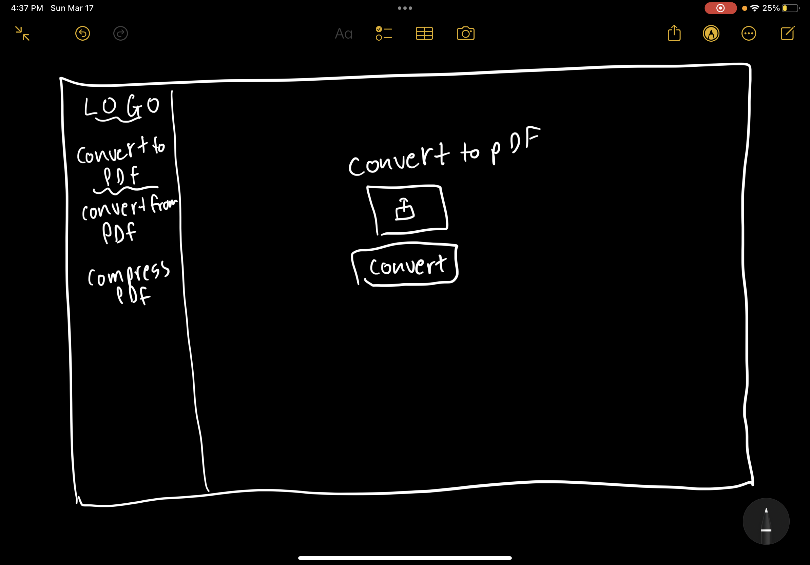
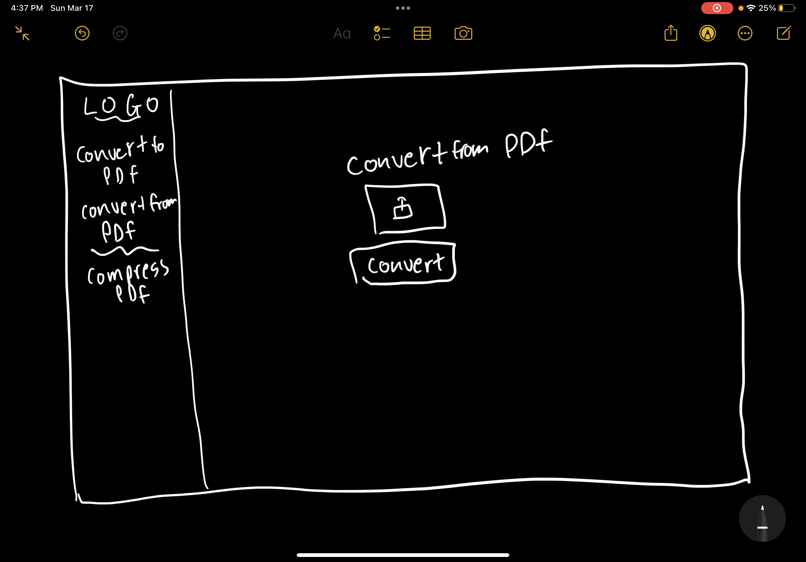
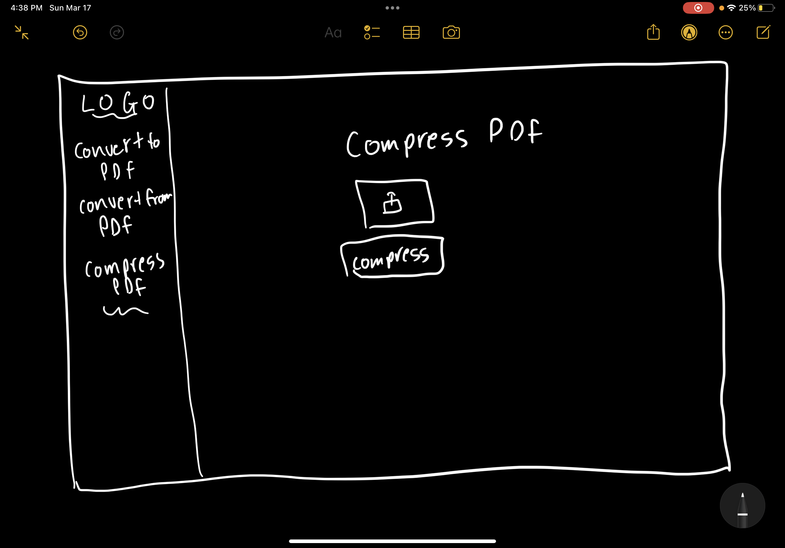

# Paperless

Created by Brandon Ramos, Daniel Figueroa, and Isaiah Hickerson.

## 🚀 Mission statement

Our application, Paperless is for anyone who deals with pdfs. It allows users to organize pdfs, compress pdfs, convert to and from pdfs, and much more.

## API

This application will use the `I love PDF` API. Below are the documentation and specific endpoints we intend to use.

- Link to API documentation: https://developer.ilovepdf.com/
- GET (Start): https://api.ilovepdf.com/v1/start/{tool}
- POST (Upload): https://{server}/v1/upload
- POST (Process): https://{server}/v1/process
- GET (Download): https://{server}/v1/download/{task}

## 👩‍💻 MVP User Stories

The core features of the application include:

- Users will be able to compress PDFS
- Users will be able to convert to PDF
- Users will be able to convert from PDF to JPG

## 🤔 Stretch User Stories

If time permits, the following stretch features will be implemented in order of priority:

- Users will be able to edit PDFs (add water marks / page numbers / draw)
- Users will be able to Encrypt PDFs with a password
- Users will be able to organize PDFs (Merge and split documents)

## 📆 Timeline for reaching MVP in 1 week

To ensure that we can complete all core features of the application in 1 week, we will aim to complete tasks according to the following timeline:

**Day 1**

- Set up MVP API endpoints

**Day 2**
-design ui
-making ui (connecting endpoints with ui)

**Day 3**

-Continued~ making ui (connecting endpoints with ui)

**Day 4**

- styling the ui into the finished look

**Day 5**

- Do some stretch features if we completed all the work

## Wireframes of each page in your application

Below, you can find wireframes for our project. Each wireframe shows a different page of our application as well as the key components of the application. Details such as specific text values or images are intentionally not included:

